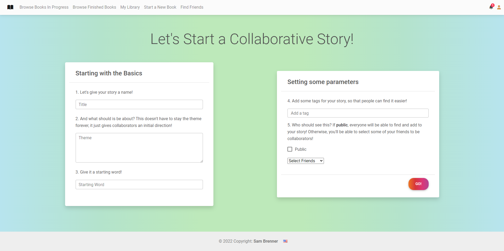
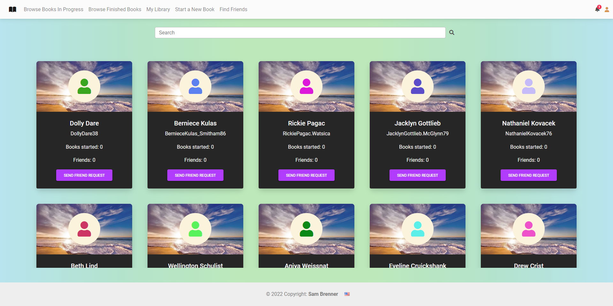
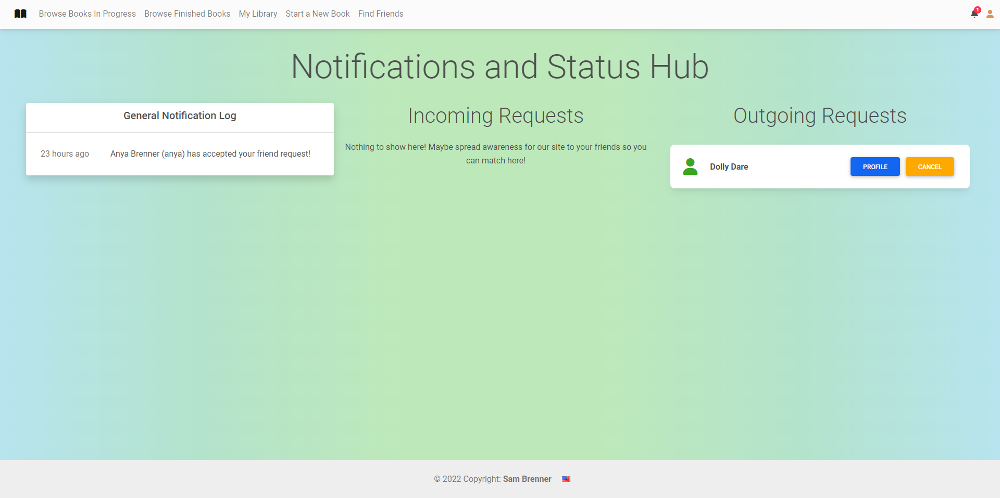
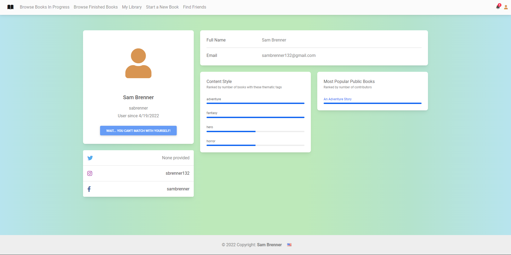
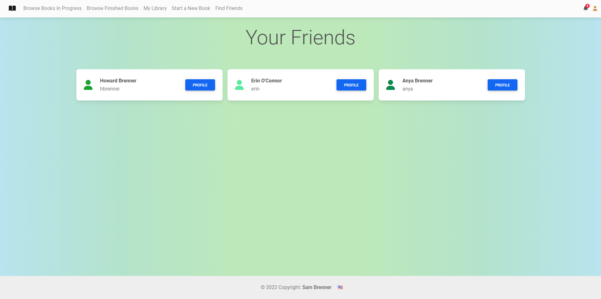
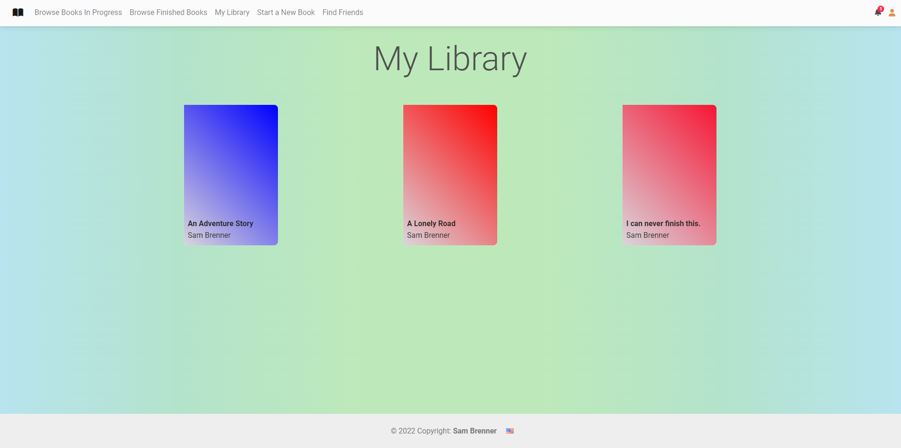
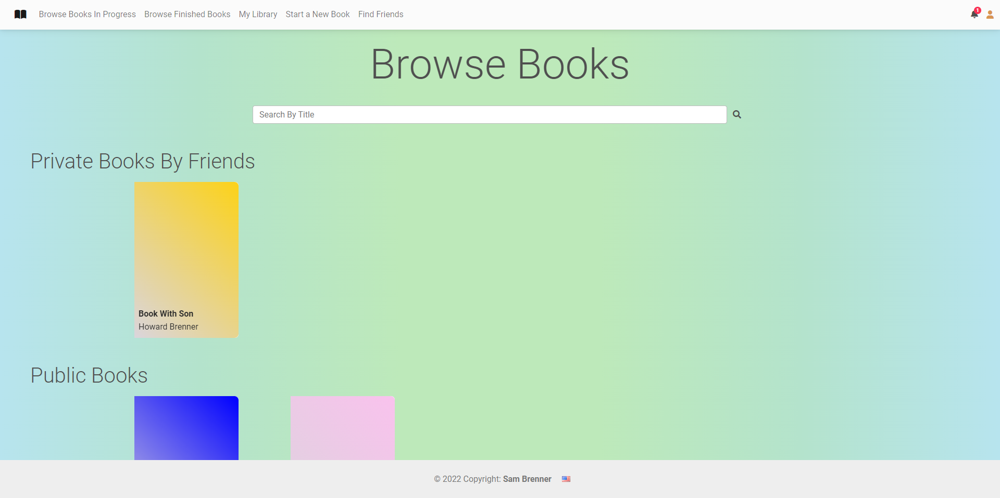
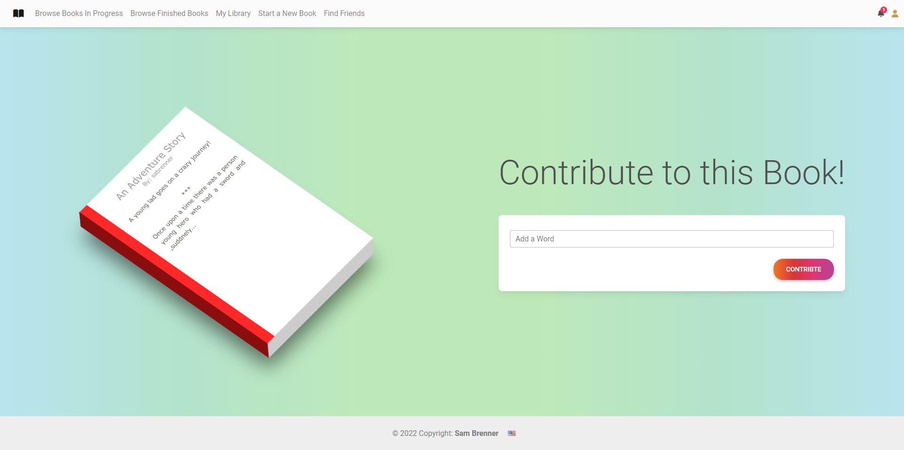

# Build-A-Book

## About

Build-A-Book is a site that allows you to collaboratively, and creatively, create and publish books. You can create and work on books publically, and have anyone contribute to your books, or create private books, and have your added friends contribute in smaller ways. All is made possible through Build-A-Book (name not finalized, for legal reasons, and will not be marketed. This is not a real site!).

### Video Link

A brief video explaining the project pitch and proof of concept can be found [here](https://drive.google.com/file/d/1T1zJS9HsaLlG77g64tKOsftUCasJiOtZ/view?usp=sharing) (https://drive.google.com/file/d/1T1zJS9HsaLlG77g64tKOsftUCasJiOtZ/view?usp=sharing).

## Download and Installation

Follow the instructions below to both download the code and isntall the relevant libraries in order to run this application locally.

### Donwloading

The source code for this site can be either cloned by running

```bash
git clone git@github.com:sbrenner132/cs103a-cpa02.git
```

in your terminal. This will require an SSH to clone the repository successfully. Alternatively, you can clone it via HTTP with:

```bash
git clone https://github.com/sbrenner132/cs103a-cpa02.git
```

Once it is downloaded, you can navigate into the project by typing

```bash
cd cs103-cpa02
```

### Installation

Once in the project, run the following command to successfully install all of the required libraries:

```bash
npm install
```

This should install a dependency tree into `package-lock.json`. Running this command might also prompt you to run some fixes on some libraries, which if necessary, can be done with

```bash
npm audit fix --force
```

The project is almost set up - the only remaining configurations needed are some environment (`process.env`) variables. You can either set these variables when running the application, which can be done as such:

```bash
MONGO_URIi=x SESSION_SECRET=y PORT=z npm run dev
```

Where `x`, `y`, and `z` are the respective values for `MONGO_URI`, `SESSION_SECRET`, and `PORT` specifically. Alternatively, you can override their use cases in `app.js`:

```js
// app.js 28:1
const mongo_URI = process.env.MONGO_URI;
// app.js 61:9
secret: process.env.SESSION_SECRET,
// app.js 208:1
const port = process.env.PORT || '3000';
```

Where you can replace each instance of the template literals with your own values.

Alternatively, feel free to reach out to `samuelbrenner@brandeis.edu` to possibly have access to the real values.

Once that process is completed, if no other environment or process variables need to be set, the app can be run with:

```bash
npm run dev
```

Which will start the application using `nodemon`. Alternatively, you can start it in `node` using:

```bash
node app.js
```

Which will start the application in a state that requires reload upon any changes to server-side code.

From there, you can visit the application locally at `localhost:3000`, unless you specified a different port.

## Relevant Screenshots

Creating a new book



Finding new friends



View notifications and requests



View profile and statistics



View your friends



View your library



Browse books



View and contribute to a book


